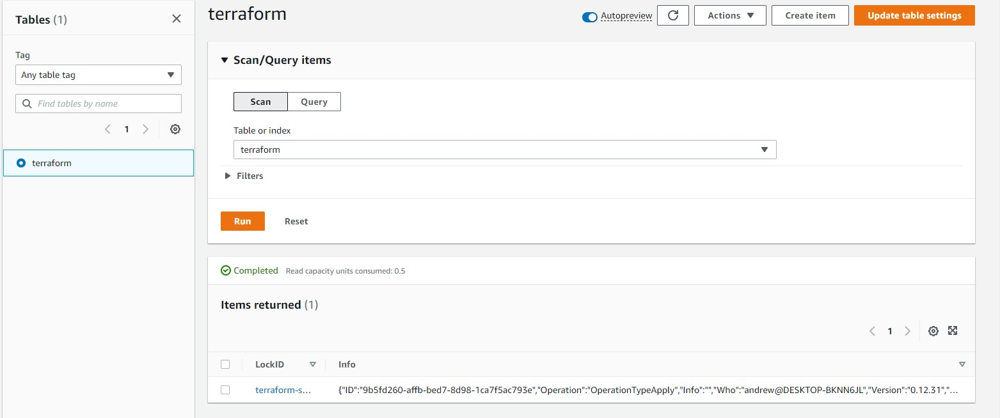
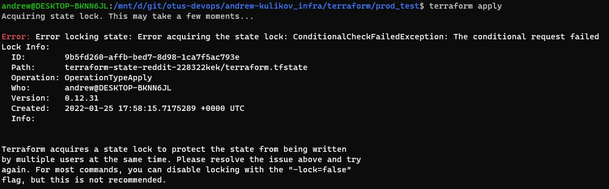

# andrew-kulikov_infra
andrew-kulikov Infra repository

## Homework 7

### Самостоятельное задание

В качестведополнительного параметра добавлен постфикс с именем среды в имя инстанса. Для разных сред были использованы постфиксы prod и stage соответственно. Для передачи конфигурации в 2 разных модуля оказался удобным блок `locals`:

```terraform
locals {
  environment = "prod"
}

module "db" {
  source           = "../modules/db"
  environment      = local.environment
  ...
}

module "app" {
  source              = "../modules/app"
  environment         = local.environment
  ...
}
```

Пример использования:
```terraform
resource "yandex_compute_instance" "db" {
  name = "reddit-db-${var.environment}"
  ...
}
```
### Дополнительное задание 1. Удаленный state и shared lock

Для настройки бэкенда terraform был использован файл [backend-config](terraform/prod/config.s3.backendconfig.example), чтобы не сорханять в репозитории такую информацию, как ключи аккаунта и имя бакета. Инициализацию запускаем с помощью команды `terraform init -backend-config=config.s3.backendconfig`.

При использовании из разных папок общий state работет, локальный файл не создается, а подтягивается файл из object storage. Однако при при попытке параллельного создания без лока получаем ошибку следующего типа (первый процесс уже начал создавать инстанс с таким же именем):
```
Error: Error while requesting API to create instance: server-request-id = f43ddf3a-c37e-4761-9ead-b540565c5c9c server-trace-id = f1ee6bc6b40d09fe:c70170720cfa15e2:f1ee6bc6b40d09fe:1 client-request-id = dff618c3-6429-484a-9d1e-a73d09a7cffa client-trace-id = 1fa32fb3-4d0f-41f5-83d3-69d65b304549 rpc error: code = AlreadyExists desc = Instance with name "reddit-app-prod" already exists

  on ../modules/app/main.tf line 1, in resource "yandex_compute_instance" "app":
   1: resource "yandex_compute_instance" "app" {
```

Для этого используем s3 dynamoDB lock. Хотя в документации заявлено о совместимости API YandexDB с DynamoDB, на последней версии aws cli и terraform могут получить список таблиц, но не могут исполнить запрос.
Из-за этого проверку производил непосредственно на AWS. Для теста был создан аккаунт, выданы пермишены на s3 и DynamoDB, создана таблица terraform. В результате получилось организовать сохранение лока в таблицу DynamoDB.

Созданный лок в таблице:



Попытка повторного запуска apply из другой папки:



### Дополнительное задание 2. Provisioning

Для организации провижининга была придумала следующая схема:
1. Конфигурационные файлы и скрипты разнесены в папки files соответствующих модулей ([app](terraform/modules/app/files) и [db](terraform/modules/db/files))
2. В каждый из модулей добавлена input variable `private_key_path` пути к приватному ключу для подключения provisioners
3. На инстансе с базой выполняем следующие действия:
  3.1. Копируем файл конфигурации [mongod.conf](terraform/modules/db/files/mongod.conf). Файл содержит специальную маску, которая должна быть заменена на ip созданного инстанса: `bindIp: 127.0.0.1,__INTERNAL_IPV4__`
  3.2. С помощью скрипта [mongo_assign_ip.sh](terraform/modules/db/files/mongo_assign_ip.sh) заменяем маску на ip инстанса, который передается провижинеру в качестве аргумента. Подстановку делаем командой `sudo sed -i "s/__INTERNAL_IPV4__/$INTERNAL_IPV4/" /tmp/mongod.conf`
  3.3. Заменяем файл конфигурации mongoDb на наш файл
  3.4. Перезапускаем mongod
4. Добавляем внутренний ip инстанса базы в output:
```terraform
output "internal_ip_address_db" {
  value = yandex_compute_instance.db.network_interface.0.ip_address
}
```
5. Передаем в модуль приложения внутренний адрес базы (`module.db.internal_ip_address_db`)
```terraform
# modules/app/variables.tf
variable mongodb_internal_ip {
  description = "Internal ip of mongodb instance"
}

# main.tf
module "app" {
  source              = "../modules/app"
  environment         = local.environment
  public_key_path     = var.public_key_path
  private_key_path    = var.private_key_path
  app_image_id        = var.app_image_id
  subnet_id           = var.subnet_id
  mongodb_internal_ip = module.db.internal_ip_address_db
}
```
6. На инстансе с приложением выполняем следующие действия:
  6.1. Для задания переменной среды в [puma.service](terraform/modules/app/files/puma.service) пользуемся аналогичным трюком - задаем маску для замены на адрес инстанса базы `Environment="DATABASE_URL=__MONGODB_URL__"`
  6.2. В скрипт [deploy.sh](terraform/modules/app/files/deploy.sh) добавляем замену маски на адрес, переданный параметром в провижинер: `sudo sed -i "s/__MONGODB_URL__/$MONGODB_URL/" /tmp/puma.service`

В результате после применения `terraform apply` получаем рабочий инстанс приложения, подключенный к базе по внутреннему адресу.
