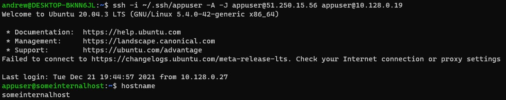
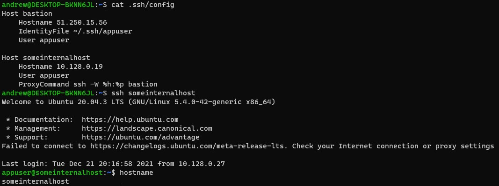
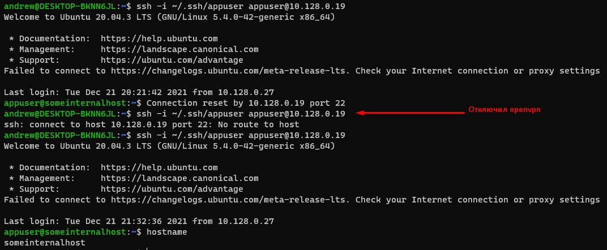
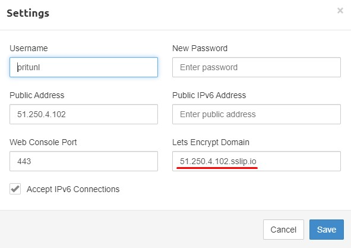
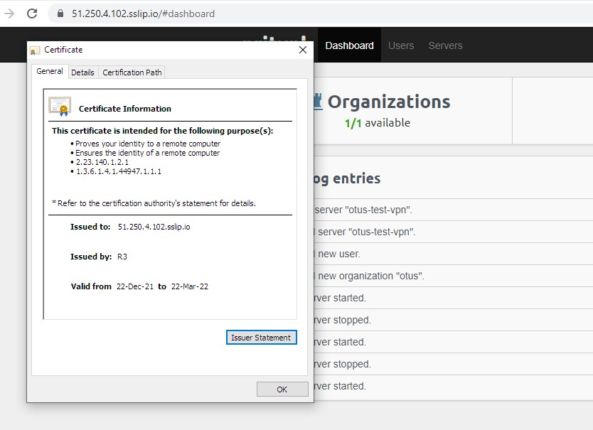

## Homework 3

### 1. Настройка Bastion Host

<b> Самостоятельное задание </b>

Подключиться в одну команду можно с использованием флага -J команды ssh. Далее передаем внешний ip bastion, затем внутренний ip someinternalshost
```bash
ssh -i ~/.ssh/appuser -A -J appuser@51.250.15.56 appuser@10.128.0.19
```


<b> Дополнительное задание  </b>

Подключаемся с помощью алиаса `ssh someintenalhost`:
1. Создаем файл конфигурации ssh: `touch ~/.ssh/config`
2. Добавляем конфигурацию. Указываем 2 хоста - bastion и someinternalhost. Для someinternalhost задаем ProxyCommand через bastion. Для bastion указываем путь к приватному ключу
```bash
Host bastion
    Hostname 51.250.15.56
    IdentityFile ~/.ssh/appuser
    User appuser

Host someinternalhost
    Hostname 10.128.0.19
    User appuser
    ProxyCommand ssh -W %h:%p bastion
```
3. Подключаемся с помощью команды `ssh someintenalhost`
4. Проверяем, что находимся на верной машине



<br />

### 2. Настройка VPN

1. Устанавливаем pritunl с помощью [скрипта](../../VPN/setupvpn.sh)
2. Проверка подключения к внутреннему хосту -


<b> Дополнительное задание  </b>

Указываем в settings сервера &lt;ip&gt;.sslip.io


В результате получаем защищенное соединение:


bastion_IP = 51.250.4.102
someinternalhost_IP = 10.128.0.19
